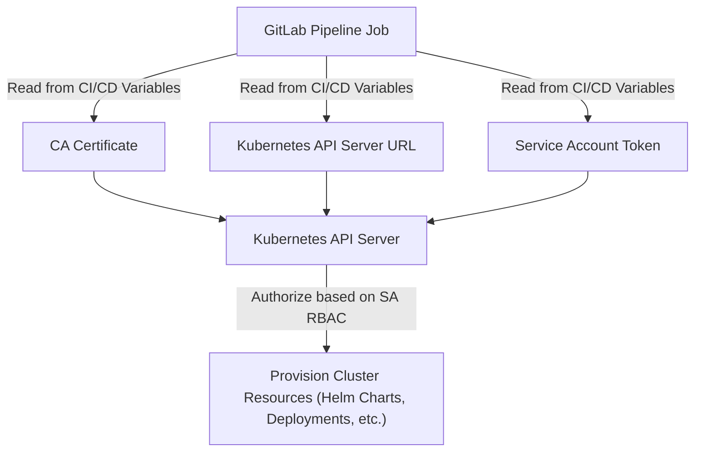

Kubernetes Annotation MutatingWebhook


- [Objective](#objective)
- [Authentication and Authorization](#authentication-and-authorization)
  - [How Authentication and Authorization Are Set Up in This Repository](#how-authentication-and-authorization-are-set-up-in-this-repository)
  - [Authentication Flow Diagram](#authentication-flow-diagram)
- [Manual installation](#manual-installation)
  - [Prerequisites](#prerequisites)
  - [Docker Repository Access](#docker-repository-access)
  - [Solution Implementation Steps](#solution-implementation-steps)
- [GitLab Pipeline Installation](#gitlab-pipeline-installation)
- [Testing](#testing)
  -[Dev and RD Clusters](#dev-and-rd-clusters)
  -[NPRi, NPR and Production Clusters](#npri,-npr-and-production-clusters)
  -[List All Pods In All Namespaces Sorted By Creation Time](#list-all-pods-in-all-namespaces-sorted-by-creation-time)
- [Problem Troubleshooting](#problem-troubleshooting)
  - [Service and DNS Configuration](#service-and-dns-configuration)
  - [Network Policies or Admission Control](#network-policies-or-admission-control)
  - [Debugging Steps](#debugging-steps)
- [Uninstallation](#uninstallation)

# Objective

The objective of this project is to add the ad.datadoghq.com/tags annotation to all running customer Kubernetes (K8s) Pods with required values.

Three methods of deploying the K8s MutatingWebhook are explained:

1. Manual installation of the K8s MutatingWebhook using K8s resource manifest files deployed using the kubectl command.
2. Standalone Helm Chart package that deploys the K8s MutatingWebhook solution using Helm templates and values file (see separate README.md in the [/helm](helm/README.md) directory).
3. GitLab Pipeline deployment of Helm Chart package that deploys the K8s MutatingWebhook solution using Helm templates and values file (see separate README.md in the [/gitlab](gitlab/README.md) directory).

# Authentication and Authorization

Every GitLab Pipeline must authenticate before it can provision resources. The type of credentials required depends on the systems being managed:

- **AWS resources with Terraform**: The pipeline requires an **IAM user** (service account) and, in some cases, one or more **IAM roles** that the user or pipeline assumes.  
- **Kubernetes resources with Helm**: The pipeline requires a **Kubernetes Service Account (SA)** with the appropriate RBAC permissions.  

If you were running the code in this repository manually from a Linux CLI, your user identity would need equivalent permissions (for example, a Kubernetes `ClusterRole` with `admin` privileges).  

👉 The key takeaway is that **authentication is always required** for a GitLab Pipeline, and **authorization** determines *what actions that identity can perform* once authenticated.

## How Authentication and Authorization Are Set Up in This Repository

This pipeline provisions Kubernetes resources using Helm. To authenticate with the Kubernetes API and authorize operations, it relies on a **Kubernetes Service Account (SA)**.  

The following three components are required to enable this:

1. **CA Certificate** – Ensures secure communication with the Kubernetes API server.  
2. **Kubernetes API Server URL** – The endpoint through which the pipeline communicates with the cluster.  
3. **Service Account Token** – The credential used to authenticate as the Service Account.  

These values are **manually retrieved** from the Kubernetes cluster using `kubectl` and related CLI commands. For convenience, a Bash script is available to automate this process: [get-k8s-auth-env-vars.sh](https://gitlab.tecsysrd.cloud/ops/noc/general-scripts/-/blob/main/gitlab/get-k8s-auth-env-vars.sh?ref_type=heads).  

The script extracts the **CA Certificate**, **Kubernetes API Server URL**, and **Service Account Token**, and outputs them in a format that can be directly added as **GitLab CI/CD Variables**.  

Storing these values in GitLab ensures that the pipeline can securely authenticate with the Kubernetes API without hardcoding secrets in the repository, while also supporting easier rotation and updates of credentials when needed.

This setup allows the GitLab Pipeline to securely connect to the Kubernetes cluster and apply the necessary Helm charts, with permissions defined by the Service Account’s associated `Role` or `ClusterRole`.

## Authentication Flow Diagram



# Manual installation

## Prerequisites

### Access to Linux CLI

### kubectl

`kubectl` is installed by following the instructions found at the Gangway Kubectl link [https://kubectl-green.private.dev.app.tecsys.cloud/commandline](https://kubectl-green.private.dev.app.tecsys.cloud/commandline)

### Kubernetes Development Cluster

Development testing of this MutatingWewbhook was done on the Tecsys itopia-dev-default-us-east-1-green cluster.

## Docker Repository Access

A Docker repository like Docker Hub, AWS Elastic Container Registry (ECR), JFrog Artifactory, etc is required for storing the Webhook Docker image that will be used in the solution.  For this PoC I initially used AWS ECR and then switched to Artifactory using an image pushed using the [https://gitlab.tecsysrd.cloud/ops/noc/noc-base-docker-images.git](https://gitlab.tecsysrd.cloud/ops/noc/noc-base-docker-images.git) repository.

## Solution Implementation Steps

### Step 1: Generate TLS Certificates

Kubernetes admission webhooks require the webhook server to use HTTPS. A TLS certificate and key needs to be generated with a Subject Alternative Name that **must match** the name of the Service.  This can be done using the following five openssl commands:

*Generate a Private Key for the CA*<br>
`openssl genrsa -out ca.key 2048`<br>
*Create a Self-Signed Certificate for the CA*<br>
`openssl req -x509 -new -nodes -key ca.key -subj "/CN=MutatingWebhookCA" -days 365 -out ca.crt`<br>
*Generate the Webhook Server Private Key*<br>
`openssl genrsa -out webhook-server.key 2048`<br>
*Create a Certificate Signing Request (CSR) for the Webhook Server*<br>
`openssl req -new -key webhook-server.key -subj "/CN=add-annotations-webhook-svc.mutatingwh.svc" -out webhook-server.csr`<br>
*Sign the Webhook Server Certificate with the CA*<br>
`openssl x509 -req -in webhook-server.csr -CA ca.crt -CAkey ca.key -CAcreateserial -out webhook-server.crt -days 365 -extfile <(echo "subjectAltName=DNS:add-annotations-webhook-svc.mutatingwh.svc")`<br>

A bash script called `gencert.sh` was created to run the preceding five openssl commands.

### Step 2: Write the Webhook Server Code

A simple Python Flask server (webhook.py) is used to handle mutating admission requests. Here’s the Python code:

```
# preserve the value of any label's that already exist
# get cluster_type, environment_type and region from the cluster-info ConfigMap in the Deploy namespace

import json
from flask import Flask, request, jsonify
import base64
import logging
from kubernetes import client, config
from kubernetes.client.rest import ApiException

app = Flask(__name__)

# Configure logging
logging.basicConfig(
    level=logging.INFO,  # Log level: can be DEBUG, INFO, WARNING, ERROR, CRITICAL
    format='%(asctime)s - %(levelname)s - %(message)s',  # Log format
    handlers=[
        logging.StreamHandler()  # Output logs to stdout/stderr
    ]
)
logger = logging.getLogger(__name__)  # Create a logger

# Initialize Kubernetes client
config.load_incluster_config()
core_v1_api = client.CoreV1Api()

def get_value_from_configmap(key, description):
    """Fetch a specific value from the 'cluster-info' ConfigMap in the 'deploy' namespace."""
    try:
        # Read ConfigMap
        cluster_info = core_v1_api.read_namespaced_config_map(name="cluster-info", namespace="deploy")

        if cluster_info and cluster_info.data:
            value = cluster_info.data.get(key, f"N/A. No {description} found")
            logger.info(f"{description.capitalize()}: {value}")
            return value
        else:
            logger.warning(f"ConfigMap 'cluster-info' is empty or missing 'data' field.")
            return f"N/A. No {description} found"
    
    except client.exceptions.ApiException as e:
        if e.status == 404:
            logger.warning(f"ConfigMap 'cluster-info' not found. Returning default for {description}.")
            return f"N/A. No {description} found"
        else:
            logger.error(f"Error fetching ConfigMap: {str(e)}")
            raise  # Re-raise unexpected errors

    except config.ConfigException as e:
        logger.error(f"Error loading kube config: {str(e)}")
        return f"N/A. No {description} found"

    except Exception as e:
        logger.error(f"Unexpected error: {str(e)}")
        return f"N/A. No {description} found"

@app.route('/mutate', methods=['POST'])
def mutate():
    """Handles admission requests to mutate Pods."""
    try:
        # Much of the following code was taken from update.py written by Alexandru Grecu

        # Read the admission review request JSON body
        admission_review = request.get_json()

        # Ensure the request is valid
        if admission_review:
            logger.debug(f"AdmissionReview Request: {json.dumps(admission_review)}")
        else:
            logger.warning("Received an invalid request with no JSON payload.")
            return jsonify({"error": "Invalid request"}), 400

        # Extract pod metadata (name, namespace, and labels) from the request body
        pod_metadata = admission_review["request"]["object"]["metadata"]

        pod_name     = pod_metadata.get("name", "unnamed")  # Default to "unnamed" if name is not set
        namespace    = pod_metadata.get("namespace", "default")  # Default to "default" if namespace is not set
        labels       = pod_metadata.get("labels", {})
        client_name  = labels.get('client', 'client-label-not-found') if labels else 'labels-not-found'
        environment  = labels.get('environment', 'environment-label-not-found') if labels else 'labels-not-found'
        release      = labels.get('release', 'release-label-not-found') if labels else 'labels-not-found'

        logger.info(f"Received mutation request for Pod: {pod_name} in Namespace: {namespace}")

        # Fetch the values from cluster-info configmap
        cluster_type = get_value_from_configmap('cluster_type', 'color')
        environment_type = get_value_from_configmap('environment_type', 'environment type')
        region = get_value_from_configmap('region', 'region')

        # Open and read the file into a List
        file_path = "/data/live-list.txt"
        try:
            with open(file_path, "r") as file:
                # Read each line, strip any surrounding whitespace (like newlines), and add to a list
                live_namespaces = [line.strip() for line in file]
            logger.info(f"Loaded live namespaces from {file_path}")
        except FileNotFoundError:
            logger.warning("The file {file_path} was not found")
        except PermissionError:
            logger.error("You do not have permission to open {file_path}")

        # Set the 'live' label based on the namespace
        live_value = "true" if namespace in live_namespaces else "false"

        # Set the 'kind' label based on the labels object
        if 'statefulset.kubernetes.io/pod-name' in labels:
            kind = "Stateful"
        else:
            kind = "Stateless"

        ids = {}
        # Open and read the file into a Nested Dictionary
        file_path = "/data/id-nested-dict.txt"
        try:
            with open(file_path, 'r') as file:
                for line in file:
                    if ':' in line:
                        key, value = line.strip().split(':', 1)
                        ids[key] = json.loads(value)
            logger.info(f"Loaded IDs from {file_path}")
        except FileNotFoundError:
            logger.warning("The file {file_path} was not found")
        except PermissionError:
            logger.error("You do not have permission to open {file_path}")

        matching_id = get_matching_id(pod_name, ids)
        release = pod_metadata.metadata.annotations.get('meta.helm.sh/release-name', release) if pod_metadata.metadata.annotations else 'N/A. No annotations found'
        
        if matching_id:
            service = matching_id.get('service', 'service-label-not-found')
            role    = matching_id.get('role', 'role-label-not-found')
        else:
            service = 'service-label-not-found'
            role    = 'role-label-not-found'
            release = 'release-label-not-found'

        service = labels.get('service', service) # preserve the value of the service variable if the 'service' key is not found in the 'labels' dictionary
        role    = labels.get('role', role)       # preserve the value of the role variable if the 'role' key is not found in the 'labels' dictionary

        # Define the annotation to be added
        annotation_tags = {
            "env": f"{environment_type}",
            "cluster_type": f"{cluster_type}",
            "namespace": f"{namespace}",
            "client_name": f"{client_name}",
            "client_environment": f"{environment}",
            "release": f"{release}",
            "live": f"{live_value}",
            "service": f"{service}",
            "role": f"{role}",
            "kind": f"{kind}",
            "region": f"{region}",
        }

        # Convert annotation tags to a JSON string
        annotation_tags_str = json.dumps(annotation_tags)

        # Define the patch to add the annotation
        patch = [
            {
                "op": "add",
                "path": "/metadata/annotations/ad.datadoghq.com~1tags",  # "~1" is required to escape "/"
                "value": annotation_tags_str
            }
        ]

        # Encode the patch to base64
        patch_base64 = base64.b64encode(json.dumps(patch).encode()).decode()

        # Prepare the admission review response
        admission_response = {
            "uid": admission_review['request']['uid'],
            "allowed": True,
            "patchType": "JSONPatch",
            "patch": patch_base64
        }

        # Return the admission review response
        response = {
            "apiVersion": "admission.k8s.io/v1",
            "kind": "AdmissionReview",
            "response": admission_response
        }

        logger.info(f"Label mutation applied to the {pod_name} Pod in the {namespace} Namespace.")
        return jsonify(response)

    except Exception as e:
        # Log the error and return a 500 status code
        logger.error(f"Error processing request: {str(e)}")
        return jsonify({"error": "An internal error occurred"}), 500

def get_matching_id(metadata_name, ids_dict):
    # Iterate through the keys in the dictionary
    for key in ids_dict:
        # Check if the key is contained in the metadata.name string
        if key in metadata_name:
            return ids_dict[key]
    return None

if __name__ == '__main__':
    try:
        logger.info("Starting the webhook server...")
        app.run(host='0.0.0.0', port=443, ssl_context=('/tls/tls.crt', '/tls/tls.key'))
    except Exception as e:
        logger.critical(f"Error starting the webhook server: {str(e)}")
```

### Step 3: Create a Dockerfile

Packaging the webhook server shown in Step 2 as a Docker service involves creating a Docker image for the server and then deploying that image in your Kubernetes cluster.  The Docker image is created using a Dockerfile. The Dockerfile will describe how to build the Docker image from the webhook.py server code.

```
# Use the official Python image.
FROM python:3.9-slim

# Set the working directory.
WORKDIR /app

# Copy the requirements file.
COPY requirements.txt requirements.txt

# Install dependencies.
RUN pip install --no-cache-dir -r requirements.txt

# Copy the webhook server code.
COPY app/webhook.py webhook.py

# Expose port 443 for the webhook.
EXPOSE 443

# Run the webhook server.
CMD ["python", "webhook.py"]
```

### Step 4: Create a requirements.txt file

Create a requirements.txt file to include the Python dependencies for the Flask server:

```
Flask==3.0.2
jsonify
Werkzeug==3.0.3
Kubernetes
```

### Step 5: Build the Docker Image

The Docker image was built using the [https://gitlab.tecsysrd.cloud/ops/noc/noc-base-docker-images.git](https://gitlab.tecsysrd.cloud/ops/noc/noc-base-docker-images.git) repository.

### Step 6: Push the Docker Image to a Container Registry

The image was pushed to Artifactory using the [https://gitlab.tecsysrd.cloud/ops/noc/noc-base-docker-images.git](https://gitlab.tecsysrd.cloud/ops/noc/noc-base-docker-images.git) repository.

### Step 7: Deploy the Webhook Server as a Kubernetes Service

#### *Create a Kubernetes NameSpace, ConfigMap, Deployment and Service Manifest for the webhook server.*

Create a namespace.yaml manifest file:

```
apiVersion: v1
kind: Namespace
metadata:
  namespace: mutatingwh
```

Create a configmap.yaml manifest file for testing:

```
apiVersion: v1
kind: ConfigMap
metadata:
  name: liveconfigmap
  namespace: mutatingwh
data:
  live-list.txt: |
    advent
    avera
    banner
    cchmc
    cisss
    houstonm
    humana
    kendallelectric
    lifespan
    lsl
    mcleod
    mdanderson
    northernha
    northwestern
    orlandohealth
    parkview
    prismahealth
    sistersofmercy
    stlukehs
    tchpharmacy
    truepill
    uhsh
    uom
    virtua
    wmrh
    wvuhs
---
apiVersion: v1
kind: ConfigMap
metadata:
  name: idsconfigmap
  namespace: mutatingwh
data:
  id-nested-dict.txt: |
    cognos: {"service": "tecsys-cognos", "role": "bi", "state": "stateful"}
    iguana: {"service": "tecsys-iguana", "role": "iguana", "state": "stateful"}
    keycloak-sso-headless: {"service": "keycloak-sso-headless", "role": "authentication", "state": "stateful"}
    keycloak-sso: {"service": "keycloak-sso", "role": "authentication", "state": "stateful"}
    postgresql-sso-headless: {"service": "postgresql-sso-headless", "role": "database", "state": "stateful"}
    postgresql-sso: {"service": "postgresql-sso", "role": "database", "state": "stateful"}
    redis-headless: {"service": "redis-headless", "role": "cache", "state": "stateful"}
    redis-master: {"service": "redis-master", "role": "cache", "state": "stateful"}
    redis-replicas: {"service": "redis-replicas", "role": "cache", "state": "stateful"}
    tecsys-backup: {"service": "tecsys-backup", "role": "backup", "state": "stateful"}
    tecsys-elite-appnode: {"service": "tecsys-elite-appnode", "role": "app", "state": "stateful"}
    tecsys-elite-help: {"service": "tecsys-elite-appnode", "role": "app", "state": "stateful"}
    tecsys-elite-servicenode: {"service": "tecsys-elite-servicenode", "role": "servicenode", "state": "stateful"}
    tecsys-ldap: {"service": "tecsys-ldap", "role": "ldap", "state": "stateful"}
    tecsys-messagebroker: {"service": "tecsys-messagebroker", "role": "messagebroker", "state": "stateful"}
    tecsys-microservices: {"service": "tecsys-microservices", "role": "microservices", "state": "stateful"}
    tecsys-sftp: {"service": "tecsys-sftp", "role": "sftp", "state": "stateful"}
```

It is **important** to understand that the above ConfigMap will need to be modified for production so that the contents of the live-list.txt and id-nested-dict.txt files contain the correct production values.  The live-list.txt file must contain the list of production namespaces that will have an annotation of `live=true`.

Create a deployment.yaml manifest file:

```
apiVersion: apps/v1
kind: Deployment
metadata:
  name: add-annotations-webhook
  namespace: mutatingwh 
spec:
  replicas: 2
  selector:
    matchLabels:
      app: add-annotations-webhook
  template:
    metadata:
      annotations:
        checksum/config: '{{ include (print $.Template.BasePath "/configmap.yaml") . | sha256sum }}'
      labels:
        app: add-annotations-webhook
    spec:
      containers:
        - name: webhook
          image: artifactory.tecsysrd.cloud/tecsys-noc/add-annotations-webhook:v2-df9c2a52
          ports:
            - containerPort: 443
          volumeMounts:
            - name: tls-certs
              mountPath: /tls
              readOnly: true
            - name: live-volume
              mountPath: /data/live-list.txt
              subPath: live-list.txt
            - name: ids-volume
              mountPath: /data/id-nested-dict.txt
              subPath: id-nested-dict.txt
          resources:
            limits:
              cpu: "500m"
              memory: "512Mi"
            requests:
              cpu: "250m"
              memory: "256Mi"
      volumes:
        - name: tls-certs
          secret:
            secretName: webhook-tls
        - name: live-volume
          configMap:
            name: liveconfigmap
        - name: ids-volume
          configMap:
            name: idsconfigmap

```

Create a service.yaml manifest file:

```
apiVersion: v1
kind: Service
metadata:
  name: add-annotations-webhook-svc
  namespace: mutatingwh
spec:
  ports:
    - port: 443
      targetPort: 443
  selector:
    app: add-annotations-webhook
```

### Step 8: Create a Kubernetes Secret for the TLS Certificates

Create a Kubernetes Secret to hold the TLS certificate and key:

`kubectl create secret tls webhook-tls --cert=certificates/webhook-server.crt --key=certificates/webhook-server.key -n mutatingwh`

### Step 9: Apply the Deployment and Service

Deploy the K8s webhook server resources:

```
kubectl apply -f namespace.yaml
kubectl apply -f clusterrole.yaml
kubectl apply -f clusterrolebinding.yaml
kubectl apply -f configmap.yaml
kubectl apply -f deployment.yaml
kubectl apply -f service.yaml
kubectl apply -f hpa.yaml
kubectl apply -f globalnetworkpolicy.yaml
```
 
## Step 10: Configure the MutatingWebhookConfiguration Manifest

Create a mutatingwebhookconfiguration.yaml file:

```
apiVersion: admissionregistration.k8s.io/v1
kind: MutatingWebhookConfiguration
metadata:
  name: add-annotations-webhook
  namespace: mutatingwh
webhooks:
  - name: add-annotations.k8s.io
    clientConfig:
      service:
        name: add-annotation-webhook-svc
        namespace: mutatingwh
        path: "/mutate"
      caBundle: {{ .Values.MutatingWebhookConfiguration.certAuthBundle }}
    admissionReviewVersions: ["v1"]
    sideEffects: None
    namespaceSelector:
      matchExpressions:
        - key: kubernetes.io/metadata.name
          operator: NotIn
          values: ["default", "kube-system", "kube-public", "kube-node-lease", "calico-apiserver", "calico-system", "monitoring", "dashboard", "deploy", "security", "sso", "istio-system", "argocd", "mutatingwh", "latest", "mi20231x", "mi20232x", "mi20222x", "datamasters"]  # Only namespaces not in this list will be affected.  This list was taken from update.py written by Alexandru Grecu.
    rules:
      - operations: ["CREATE"]
        apiGroups: [""]
        apiVersions: ["v1"]
        resources: ["pods"]
    failurePolicy: Fail
```

For the caBundle value, encode the CA certificate (tls.crt) created in Step 1 to base64:

`cat ca.crt | base64 | tr -d '\n'`

Replace <BASE64_ENCODED_CA_CERT> in the mutatingwebhookconfiguration.yaml file with the base64-encoded certificate.

Finally, apply the configuration:

`kubectl apply -f mutatingwebhookconfiguration.yaml`

Now, only in the namespace that matches the namespaceSelector, the webhook server should be intercepting pod creation requests and adding the specified annotations dynamically.

# GitLab Pipeline Installation

 As explained in the [Authentication and Authorization](#authentication-and-authorization) section a K8s Service Account must exist before the GitLab pipeline can be run.  Also, because the K8s Service Account exists in the `mutatingwh` namespace then the `mutatingwh` namespace must exist before the K8s Service Account can be created.

 Therefore, the `mutatingwh` namespace must be manually created using this K8s manifest file:

 ```
 apiVersion: v1
kind: Namespace
metadata:
  annotations:
    meta.helm.sh/release-name: k8s-annotation-mutatingwebhook
    meta.helm.sh/release-namespace: gitlab
  labels:
    app.kubernetes.io/managed-by: Helm
    kubernetes.io/metadata.name: mutatingwh
  name: mutatingwh
```

  Once the `mutatingwh` namespace has been created then the Service Account can be created using the `set-gitlab-env-vars.sh` bash script found in the [general-scripts](https://gitlab.tecsysrd.cloud/ops/noc/general-scripts) GitLab repository at this location: https://gitlab.tecsysrd.cloud/ops/noc/general-scripts/-/blob/main/gitlab/set-gitlab-env-vars.sh?ref_type=heads

  You will need to edit the `et-gitlab-env-vars.sh` script to set the ENV, REGION, COLOR and GITLAB_TOKEN values as shown in the example below:

  ```
ENV="PROD"
REGION="us_east_1"
COLOR="BLUE"
GITLAB_TOKEN="glpat-0123456789"
```

Once this is done then you can run the GitLab pipeline.

# Testing

Check the helm installation by running the following command:
 
```
kubectl -n mutatingwh get all,cm,secret,MutatingWebhookConfiguration,hpa,globalnetworkpolicies.crd.projectcalico.org -o wide
```

A correct installation should show these K8s resources:

* Pod,
* ReplicaSet,
* Deployment,
* HorizontalPodAutoscaler,
* Service,
* Secret,
* MutatingWebhookConfiguration, and
* GlobalNetworkPolicy

There are two Pod manifests in the test-pods subdirectory that will create a basic nginx in the default and mutatingwh namespace.  If you describe these Pods you will see the required annotations in the nginx Pod in the mutatingmh namespace.
Also, the testing can be performed just from the CLI using the following kubectl commands:

## Dev and RD Clusters

The Dev and RD clusters do not have customer namespaces. Therefore, the actual list of live namespaces cannot be used and we must create artificial namespaces to test against.  For the tests below to work the ConfigMap named `liveconfigmap` must contain the mutatingwh1 and mutatingwh3 namespaces.

```
kubectl create ns mutatingwh1
kubectl create ns mutatingwh2
kubectl create ns mutatingwh3

kubectl run nginx --image=nginx
kubectl run nginx --image=nginx -n mutatingwh1
kubectl run nginx --image=nginx -n mutatingwh3

kubectl get pod nginx -o yaml
...
metadata:
  annotations:

kubectl -n mutatingwh1 get pod nginx -o yaml
...
metadata:
  annotations:
    ad.datadoghq.com/tags: '{"env": "prd", "cluster_type": "blue", "namespace": "mcleod",
      "client_name": "mcleod", "client_environment": "default", "release": "N/A. No
      release name found", "live": "true", "service": "tecsys-elite-appnode", "role":
      "app", "kind": "Stateful", "region": "us-east-1"}'

kubectl -n mutatingwh3 get pod nginx -o yaml
...
metadata:
  annotations:
    ad.datadoghq.com/tags: '{"env": "prd", "cluster_type": "blue", "namespace": "mcleod",
      "client_name": "mcleod", "client_environment": "default", "release": "N/A. No
      release name found", "live": "true", "service": "tecsys-elite-appnode", "role":
      "app", "kind": "Stateful", "region": "us-east-1"}'
```

### JSON Formatted Annotations

For more readable output of the annotations use either of the two following command:

```
kubectl -n cloudtest get pod nginx -o json | jq '.metadata.annotations'
kubectl -n cloudtest get pod nginx -o jsonpath='{.metadata.annotations}' | jq

```

### Cleanup

```
kubectl delete ns mutatingwh3
kubectl delete ns mutatingwh2
kubectl delete ns mutatingwh1
```

## NPRi, NPR and Production Clusters

The actual customer namespaces exist in these clusters and, therefore, we must test against one of the customer namespaces in the `live-list.txt` found in the ConfigMap named `liveconfigmap`.  In the example below we test using the `cloudtest` namespace.

```
kubectl run nginx --image=nginx -n cloudtest --dry-run=server -o yaml
```

Check the annotation section of the output and confirm you see the correct annotations.  For instance, you should see annotations like these:

```
ad.datadoghq.com/tags: '{"env": "prd", "cluster_type": "blue", "namespace": "mcleod",
  "client_name": "mcleod", "client_environment": "default", "release": "N/A. No
  release name found", "live": "true", "service": "tecsys-elite-appnode", "role":
  "app", "kind": "Stateful", "region": "us-east-1"}'
```

### JSON Formatted Annotations

For more readable output of the annotations use either of the two following command:

```
kubectl -n cloudtest get pod nginx -o json | jq '.metadata.annotations'
kubectl -n cloudtest get pod nginx -o jsonpath='{.metadata.annotations}' | jq

```

#### Examples

Both of these examples produce the same output.

json example:

```
kubectl -n mcleod get pod default-tecsys-elite-appnode-0 -o json | jq '.metadata.annotations'
{
  "ad.datadoghq.com/tags": "{\"env\": \"prd\", \"cluster_type\": \"blue\", \"namespace\": \"mcleod\", \"client_name\": \"mcleod\", \"client_environment\": \"default\", \"release\": \"N/A. No release name found\", \"live\": \"true\", \"service\": \"tecsys-elite-appnode\", \"role\": \"app\", \"kind\": \"Stateful\", \"region\": \"us-east-1\"}",
  "admission.datadoghq.com/java-lib.version": "v1.0.0",
  "cluster-autoscaler.kubernetes.io/safe-to-evict-local-volumes": "datadog,datadog-auto-instrumentation,datadog-auto-instrumentation-etc",
  "istio.io/rev": "default",
  "kubectl.kubernetes.io/default-container": "tecsys-elite-appnode",
  "kubectl.kubernetes.io/default-logs-container": "tecsys-elite-appnode",
  "prometheus.io/path": "/stats/prometheus",
  "prometheus.io/port": "15020",
  "prometheus.io/scrape": "true",
  "sidecar.istio.io/status": "{\"initContainers\":[\"istio-init\"],\"containers\":[\"istio-proxy\"],\"volumes\":[\"workload-socket\",\"credential-socket\",\"workload-certs\",\"istio-envoy\",\"istio-data\",\"istio-podinfo\",\"istio-token\",\"istiod-ca-cert\"],\"imagePullSecrets\":null,\"revision\":\"default\"}"
}
```

jsonpath example:

```
kubectl -n mcleod get pod default-tecsys-elite-appnode-0 -o jsonpath='{.metadata.annotations}' | jq
{
  "ad.datadoghq.com/tags": "{\"env\": \"prd\", \"cluster_type\": \"blue\", \"namespace\": \"mcleod\", \"client_name\": \"mcleod\", \"client_environment\": \"default\", \"release\": \"N/A. No release name found\", \"live\": \"true\", \"service\": \"tecsys-elite-appnode\", \"role\": \"app\", \"kind\": \"Stateful\", \"region\": \"us-east-1\"}",
  "admission.datadoghq.com/java-lib.version": "v1.0.0",
  "cluster-autoscaler.kubernetes.io/safe-to-evict-local-volumes": "datadog,datadog-auto-instrumentation,datadog-auto-instrumentation-etc",
  "istio.io/rev": "default",
  "kubectl.kubernetes.io/default-container": "tecsys-elite-appnode",
  "kubectl.kubernetes.io/default-logs-container": "tecsys-elite-appnode",
  "prometheus.io/path": "/stats/prometheus",
  "prometheus.io/port": "15020",
  "prometheus.io/scrape": "true",
  "sidecar.istio.io/status": "{\"initContainers\":[\"istio-init\"],\"containers\":[\"istio-proxy\"],\"volumes\":[\"workload-socket\",\"credential-socket\",\"workload-certs\",\"istio-envoy\",\"istio-data\",\"istio-podinfo\",\"istio-token\",\"istiod-ca-cert\"],\"imagePullSecrets\":null,\"revision\":\"default\"}"
}
```

## List All Pods In All Namespaces Sorted By Creation Time

Check that this MutatingWebhook is not preventing new Pods from being created by running the following command:

```
kubectl get po -A --sort-by={metadata.creationTimestamp} --no-headers
```

Confirm Pods have been created after the MutatingWebhook was installed.

# Problem Troubleshooting

## Service and DNS Configuration

The webhook relies on the Kubernetes DNS service to resolve the service name (add-annotations-webhook-svc.mutatingwh.svc). If DNS is not properly configured or delayed, the webhook request might time out.

### Solutions

Verify that the service is reachable:

```
kubectl run test --rm -it --image=busybox -- /bin/sh
nslookup add-annotations-webhook-svc.mutatingwh.svc
```

or

```
kubectl run test --rm -it --image=busybox -- /bin/sh
nslookup add-annotations-webhook-svc.mutatingwh.svc.cluster.local
```

If the DNS resolution fails, check the kube-dns or coredns deployment.

## Network Policies or Admission Control

If your cluster uses network policies, admission controllers, or other security mechanisms, they might block communication between the API server and the webhook.

Here are some commands that will help with Calico GlobalNetworkPolicy.

```
kubectl get crds
kubectl get crds | grep networkpolicies
kubectl get globalnetworkpolicies.crd.projectcalico.org
kubectl explain globalnetworkpolicies.crd.projectcalico.org
kubectl get globalnetworkpolicies.crd.projectcalico.org ingress-allow-kubeapi-endpoint -o yaml
kubectl describe globalnetworkpolicies.crd.projectcalico.org mwh-network-policy
kubectl get globalnetworkpolicies.crd.projectcalico.org mwh-network-policy -o yaml
```

[Calico GlobalNetworkPolicy Documentation](https://docs.tigera.io/calico/latest/reference/resources/globalnetworkpolicy)

### Solutions

Ensure network policies allow traffic between the API server and the webhook service.

Test connectivity

```
kubectl run test --rm -it --image=busybox -- /bin/sh
wget https://add-annotations-webhook-svc.mutatingwh.svc:443/mutate --no-check-certificate
```

or

```
kubectl run test --rm -it --image=busybox -- /bin/sh
wget https://add-annotations-webhook-svc.mutatingwh.svc.cluster.local:443/mutate --no-check-certificate
```

Review the kube-apiserver logs for errors related to webhook communication.

## Debugging Steps

1. Check the logs of the running webhook pod

```
kubectl logs <webhook-pod-name>
```

2. Look for specific Python stack traces or timeout messages.

3. Increase logging verbosity for kube-apiserver and look for webhook-related errors.

# Uninstallation

All the K8s MutatingWebhook resources are uninstalled using the `kubectl delete -f <path to K8s manifest file>` command.
